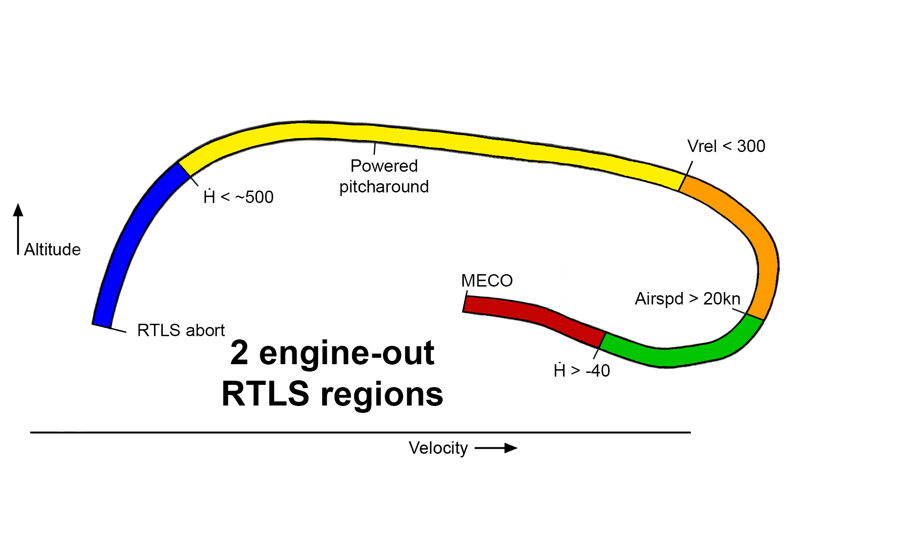

# Kerbal Space Program Space Shuttle OPS1 Ascent Guidance
## Updated September 2024

  

My KSP ascent guidance script for the Space Shuttle, intended to be used in KSP Realism Overhaul.
Uses Powered Explicit Guidance (also called UPFG) for vacuum guidance, adapted and modified to perform aborts. Allows for assisted manual flight.

# References

- [SPACE SHUTTLE ORBITER OPERATIONAL LEVEL C SOFTWARE REQUIREMENTS - GUIDANCE ASCENT/RTLS](https://www.ibiblio.org/apollo/Shuttle/STS83-0002-34%20-%20Guidance%20Ascent-RTLS.pdf)
- [Flight Procedures Handbook - Ascent/Aborts (OI-30)](https://www.ibiblio.org/apollo/Shuttle/Crew%20Training/Flight%20Procedures%20Ascent-Aborts.pdf)

# Installation

# Requirements
- A complete install of RSS/Realism Overhaul with Ferram Aerospace Resarch. 
- kOS version 1.3 at least
- kOS Ferram, now available on CKAN
- [My own fork of SpaceODY's Space Shuttle System](https://github.com/giuliodondi/Space-Shuttle-System-Expanded). 
  - if you use the latest version you will be required to also grab my Ferram Fork to use the custom aerodynamics module. Refer to the README
- **[My OPS3 Shuttle entry program](https://github.com/giuliodondi/kOS-Shuttle-OPS3) required by RTLS and TAL aborts. Grab the latest version from its repo**
  - **no longer compatible with the older kOS-ShuttleEntrySim program**
 
## Not compatible with SOCK, SpaceODY's original fork or any other Shuttle craft

You will find one folder: 
- **Script**

Put the contents of the Script folder inside Ship/Script so that kOS can see all the files.
There are a few scripts you can run:
- **ops1.ks** to setup a launch of the Shuttle from the launchpad according to specified mission parameters (read on to learn about mission setup).
- **ops1_3a.ks** is an identical script with special parameters for Polar orbit launches from Vandenberg
- **node.ks** a little manoeuvre node executor that I use to execute OMS burns in orbit, it takes care of the offset OMS thrust position (so it even works with a single OMS burn) and is compatible with nodes created with Principia

# Setup  

## Take care of the following things while building the Shuttle Stack in the VAB:
- The root part must be the Space Shuttle Orbiter part you find in my fork of Space Shuttle System
- All RCS modules on the orbiter and OMS pods must be enabled before launch
- Open the umbilical doors or the program will actuate them incorrectly
- Use the RealFuels GUI to select the appropriate version of SSME (refer to [this Wikipedia table](https://en.wikipedia.org/wiki/RS-25#/media/File:SSME_Flight_History.png)). **You must select the same version for all three SSMEs.**
- **Check that the elevons, body flap and rudder are set as required by the Entry script README**
- The ET must be a child part of some orbiter part (for the Space Shuttle System mod it's attached to the cargo bay by default)
- Set fuel flow priority on the Orbiter lower than the External Tank, or else you won't have cryos for the fuel cells once you're in orbit
- The SRB decouplers must be attached to the External Tank using the snap nodes, so that all SRB-related parts are children of the ET
- The SRBs also attach to the decouplers using snap nodes
- Any launch clamps/towers must be attached either to the ET or the SRBs, don't attach anything to the Orbiter
- Don't place clamps on the opposite side to where the Orbiter is because the angled SSMEs will push the stack in that direction and you may have a collision
- If you launch from Vandenberg, you need to switch the SRB type to the lighter 'Filament-wound casing' for extra performance

## Set the vessel staging as follows (from the bottom stage upwards) :
- SSMEs and RCS staging toggles (required for aborts and MECO attiude control)
- SRBs and any launch clamps / platform
- SRB decouplers and separation motors (both nosecone and skirt)
- External tank separation and OMS engines
- Anything in the payload bay
- Tail parachute

If you don't use SpaceShuttleSystem parts, or if you mismatch SSME versions, the script should detect this and break during vehicle initialisation. This is intended and meant to signal to you that something is wrong.

## the kOS configuration file

The mission parameters are specified in the main launch script **ops1.ks** or **ops1_3a.ks**. 

It contains variable definitions for:
- a "target_orbit" structure describing the shape of the desired orbit. Periapsis and cutoff altitude are standard for a Shuttle launch and shouldn't be changed. Only change the apoapsis and inclination to suit your needs.
- a variable to enable telemetry logging in the UPFG_OPS1/LOGS/ folder if you want to plot it with your own means
 
# The main Ascent script

Upon running **ops1.ks** you will be greeted with a GUI with buttons and a data display to interface with the program:

- The _X_ button will interrupt the program at any point
- _DAP_ selects the digital autopilot modes. By default it's AUTO but it can be switched to CSS for manual flight. More on autopilot modes later on.
- The red _ABORT_ button triggers a manual abort and the selector menu to its left selects the modes currently available. More on aborts later on.
- the _TAL site_ selector is specifically to choose an available landing site for a manual TAL abort
- the red button with the **!** symbol opens the Engine Failure setup panel, more on this in the aborts section
- the _Display_ will show different things depending on the flight phase. There will be plenty more about this later on.
- the _Message Window_ at the bottom displays printouts of the program state. Useful to monitor the abort state

**The abort buttons and selectors, except for engine failure, are frozen at program start and unfreeze after SRB separation**

## The ASCENT TRAJ displays

These two displays show useful data and trajectory printouts:
- **_TRAJ 1_** displays first stage (SRB) flight until right before SRB sep
- **_TRAJ 2_** takes over from there all the way to MECO
- At the top you have the display title and the running mission elapsed time
  - the display title is ASCENT in the nominal case, but in an abort it will change to RTLS, TAL, ATO or CONT
- On the left side you have:
  - current vertical speed **Ḣ**
  - the errors with respect to guidance commands: roll **_R_**, pitch **_P_**, yaw **_Y_**, throttle **_T_**
  - R,P,Y errors are in angles with respect to the commanded thrust direction in the vehicle-fixed frame of reference, T is a percentage.
  - When the errors are too large, the numbers will turn yellow
- **_CONT ABORT_** shows the current active contingency abort regions for 2- and 3-engine-out situations. More about this in the aborts section
- The TRAJ 1 central plot shows altitude vs. surface velocity
  - The ticks show the pitch angle that the Shuttle should have at that moment
  - The solid line is the typical nominal trajectory
  - The dashed line is the trajectory in case of one engine out at liftoff
  - The triangle is the current state, the circle is the predicted state 15 seconds into the future
- The TRAJ 2 plot is altitude vs. inertial (orbital) velocity
  - the solid line shows the early lofting and droop which is typical of the Shuttle
  - the ticks show roughly the intact abort boundaries: negative return (RTLS), press to ATO (ATO), last TAL opportunity (TAL)
  - The triangle is the current state, the circle is the predicted state 30 seconds into the future
- On the right side you have:
  - a slider with the current acceleration in G-units, the indicator will turn yellow if it exceeds 3G
  - **_THROT_** is the current throttle level in units of Rated Power Level
  - **_PROP_** is the percentage of remaining propellant in the External Tank
- On the TRAJ 2 display, below the title, there is the MECO velocity line indicator, close to MECO it shows how far off from the targeted cutoff velocity (**_CO_**) you are
- On the TRAJ2 display, in the top right corner, are some UPFG-specific values:
  - **_TGO_** is the guidance-calculated time to MECO
  - **_VGO_** is the guidance-calculated delta-V to gain to MECO
  - the numbers will be yellow when the algorithm is unconverged, green upon convergence

## Meaning of Rated Power Level and the THROT indicator

The Space Shuttle Main Engine had several performance improvements in its operational life, and you have all the variants at your disposal in KSP RO.  
The caveat is that "full power" is an ambiguous term in this situation. For this reason we define the Rated Power Level (100% RPL) as 2090 kN, the max thrust of the original variant. 
This is significant because for the later part of the Shuttle program, when they used the RS-25D variant, the nominal throttle setting was 104% RPL and boosted to the full 109% RPL in case of an abort. This was done to reduce wear and risk of failure on the engines, it's all realistic and simulated by the script.

## How to fly manually with CSS

CSS means control-stick-steering, a fly-by-wire mode that allows you to use keyboard or joystick to command changes in pitch, roll or yaw letting kOS worry about keeping stability.  
At any time you can switch between the two. **A manual ascent from liftoff to orbit in CSS is possible but challenging**.
Here are some tips and remarks on how to do it:
- switch the KSP camera to _Locked_ or switch to IVA mode
- **the errors are defined relative to the body axes, not the Earth's horizon**
- Positive Roll and Yaw errors means you need to correct to the **right**. Positive pitch error means you need to pitch **up**. Positive throttle error means you need to throttle up
- You will need to constantly correct, especialy in pitch
- Make small corrections and see the result in the Display before correcting further
- **The initial roll manoeuvre is by far the hardest:**
  - it's a combined roll, pitch and yaw manoeuvre that puts you on the right azimuth for ascent
  - It's useful not to rely solely on the numbers and also have a mental image of where the Shuttle is and how it needs to move to ascend heads-down
  - use continuous roll inputs and correct pitch and yaw as required by the error numbers
- During TRAJ 1 you can use the trajectory plot as a guide to correct your pitch, you shouldn't go too far off the line
- During TRAJ 2 I don't suggest you try to follow the line closely, the Guidance commands already account for any error you accumulated

# Nominal mission scenario

Running the **ops1.ks** or **ops1_3a.ks** script is the only action required for a nominal launch (aborts are different). Simply running the script will program the launch about 10 seconds after running the script, meaning that the LAN of the target orbit depends on the time of day you choose to launch.  
**You can launch to rendezvous with a vessel in orbit by selecting it as a target in the map view BEFORE running the script.** This will override the launch inclination to match and warp to the right time to launch so the LAN is correct.

These are the main events durign ascent:
- Fuel cells are automatically activated at liftoff
- Dynamic pressure (**Q**) is monitored throughout and SSME throttle will be reduced to 75% RPL during the Max-Q period. **If you fly CSS you have to be alert and adjust throttle**
- SRB separation is thrust-dependent and usually happens around the T+02:00 mark
- 5 seconds after SRB sep the program transitions to closed-loop guidance using the UPFG algorithm
- It should take around 10 iterations for the algorithm to converge and in the nominal case it should stay converged throughout
- On a nominal mission a roll to heads-up attitude is performed at T+05:50
- About a minute before MECO, Guidance will start throttling down the engines to maintain a maximum acceleration of 3G. **Again, if you're flying CSS you need to be alert for this**
- 5 seconds before the targeted MECO the program transitions to terminal guidance at minimum throttle
  - alternatively it can happen 5 seconds before the Shuttle runs out of propellant
- After MECO the program will automatically:
  - disable SSME gimballing
  - trigger ET sep
  - command an RCS vertical translation manoeuvre
  - actuate the umbilical doors, if you find them open it means they were closed at liftoff
- The program then prints a message in the message window, displaying the results of an orbital analysis calculating the erros with respect to the targeted orbit
- 5 seconds after this, the program will quit itself
- **Do not forget that the nominal ascent puts the shuttle on a trajectory that dips back into the atmosphere for ET disposal. You must perform manually an OMS bun to circularise.** 

# Abort scenarios

## General remarks

Abort modes are usually required whenever one or more engines fail. You can either shutdown an engine manually or setup an automatic failure using the **_Engine Failure_** panel:

- The failure mode by default is _OFF_
- the _RAND_ setting will run a probability-based algorithm to decide whether to trigger a single, double or even triple engine failure at any moment
- the _TIME_ setting allow you to schedule up to three failures at any MET you like. Click the **+** button to add a failure

There are two kinds of abort modes:
- **Intact aborts** where there always is a procedure that will take the Shuttle to a safe trajectory, either to space or to a landing runway
- **Contingency aborts** where the Shuttle cannot achieve a nominal safe trajectory and will not reach space in any way. There is no guarantee to reach a runway or even survive the reentry into the lower atmosphere

## Intact aborts

Intact aborts mean that there always is a procedure that will take the Shuttle to a landing runway with sufficient energy. The Shuttle has continuous intact abort coverage from liftoff to orbit in case of a single engine failure.  
In some regions, even a double engine failure will allow an intact abort. This is valid both for a sudden double-engine failure or a second engine failure during an ongoing abort

- Intact aborts can be triggered either manually or automatically
- **Remember that the abort selectors and buttons are inactive until after SRB separation**
- Manually, you can select an available mode from the GUI menu and then press the red _ABORT_ button to activate it
- In case of an engine failure, you have 10 seconds to select a manual abort, after which the program will automatically activate an abort mode
  - The automatic intact abort logic is: ATO-TAL-RTLS in this order of preference, based on availability
- You can manually activate an abort even without an engine failure, guidance will work just the same

  

The above chart shows the intact abort modes and their boundaries:
- **Return to launch site (RTLS)** is available from liftoff to about 2400 m/s surface-relative (the actual boundary depends on inclination). The boundary is called **NEGATIVE RETURN**
- **Transoceanic Abort Landing (TAL)** is available from just before Negative Return until late in the ascent (until Single-engine Press to ATO is available)
  - late in the ascent, Single-engine TAL should become available, this also disappears when Single-engine Press to ATO is available
- **Press to ATO** is available some time after Negative Return until Press to MECO
  - later in the ascent, Single-engine press to ATO is available
- **Press to MECO** is available roughly a minute after press to ATO, this is not really an abort mode
  - later in the ascent, Single-engine press to ATO is available

<h2>Return to Launch Site (RTLS) </h2>

RTLS is quite involved and has a powered phase (until MECO) and a Glide phase after that. Powered-RTLS guidance aims to bring the Shuttle to the following conditions at MECO:
- Altitude about 72 km
- Moving towards the launch site with velocity that depends on distance at MECO
- Less than 2% propellant remaining, no more than 20 s of burn time on two engines

There are several phases to Powered-RTLS abort:
- **Lofting** if the engine is lost before SRB sep, to try to achieve close to nominal altitude and vertical speed. Actual active RTLS guidance kicks in after SRB sep
- **Dissipation**, flying outbound for a certain time to waste fuel. Guidance is open-loop, limited to pitching up by an angle that depends the surface velocity at engine failure (or SRB sep).  
The script uses the PEG algorithm as a predictor to estimate the fuel needed to reverse course, when this matches the fuel remaining minus 2%, the dissipation phase ends. If RTLS is triggered very close to the negative return boundary, this step is skipped.
Automatic OMS dump is initiated during fuel dissipation.
- **Flyback**, where the shuttle pitches around towards the launch site and the outbound trajectory is slowly reversed to bring it home. The script uses a modified version of PEG for guidance. Since velocity-to-go and time-to-go need to match the 2% propellant constraint at MECO, as well as the constraint between position and velocity, active throttling is used as an extra degree-of-freedom. Throttling is disabled some time seconds before MECO as it can become unstable. 
The OMS fuel dump will cease before or at MECO during flyback.

### RTLS TRAJ 2 display

This display is rendered when the RTLS abort is initialised and lasts until after MECO.

- At the top you have another cutoff velocity indicator, this time in terms of surface velocity. The range is from 1500 to 2500 m/s, and since the goal is to turn back higher cutoff speeds are indicated from right to left.
    - While the CO mark is actively placed in the right place, you should expect the actual speed at cutoff to be off this mark by a little.
- The data lines are identical to the ASCENT TRAJ display, with the exceptionif an additional readout in the top-right UPFG box:
    - The desired burnout delta-time (T_C), this is the main indicator of a good RTLS guidance state, more on this later
- The central plot is a little complicated. It represents altitude on the vertical versus the horizontal component of downrange velocity from the launch site. This means there are positive velocity (i.e. travelling away) and negative velocity (travelling back) regions of the plot in the horizontal direction.
    - The Shuttle bug should move within the curved lines, first it will be in the lower right region, moving up and further right during fuel dissipation. During flyback it will start moving to the left as the Shuttle decelerates, and also down as it loses altitude. It will cross the "0" line when the Shuttle starts moving back to the launch site, then it will keep moving left and gradually start climbing once again.
    - the bottom-right curve is the nominal ascent trajectory, the Shuttle shouldn't be to the right of this
    - the top slanted curve is the maximum lofted trajectory during flyback for aborts close to the Negative Return boundary
    - The bottom segment is the depressed trajectory for a liftoff engien failure, the Shuttle is slow and heavy in this case
    - The left-most horizontal line with "CO" indicates the cutoff line at 72km altitude, the Shuttle should be close to this line at MECO

### The meaning of T_C

T_C is just a name for the difference between the time to burn down to 2% propellant minus the time-to-go coming from the PEG algorithm, it's the main figure that dictates when we should stop dissipating fuel and begin flying back
During the dissipation phase this will be positive, because TGO assumes we turn back immediately but we still have too much propellant. Actually, if the engine failure is before SRB sep and the algorithm is started when we're still close to the launch site, there might not be a good solution to find and T_C will have some nonsense values. TGO and VGO will be yellow until we're safely far enough away and T_C is stable, only then the program will accept its value to check if we should begin flyback.  
Once we trigger Flyback, T_C will settle around zero as the PEG algorithm adjusts the throttle so that we burn propellant all the way to 2% during the rest of the manoeuvre. 

### Glide-RTLS

After MECO and separation, the script will stop and automatically call the **OPS3** reentry script which takes case of  **Glide-RTLS (GRTLS)** guidance.  
In a nutshell: the Shuttle pitches up to 45° as it performs an aerobraking manoeuvre to stabilise the falling trajectory into a more nominal reentry trajectory, controlling vertical G forces. At the end of GRTLS the Shuttle will be about 200 km from the launch site, 35/40km altitude at about Mach 4, in a gentle descent.  
**Please read carefully the OPS3 documentation for more about Glide-RTLS**

### Detailed results from my RTLS tests

Here I present my test results for RTLS aborts. The scenario was STS-9 (RS-25A, Lightweight tank, Spacelab payload at 57° inclination). The only variable is the time of engine failure _t_fail_ which ranges from liftoff to just before Negative Return. The plots include both Powered and GLide RTLS phases 

The first plot is altitude vs. downrange distance, and shows the general shape of the trajectory. You can see:
- engine failures before SRB sep result in lofted trajectories, as commanded
- The maximum altitude during the manoeuvre is geenrally higher the later the engine failure
- all trajectories target the same altitude at MECO, it's the "hump" at 72km
- The downrange distance at MECO is different for all trajectories

The second plot is horizontal velocity vs. altitude. Here you can see clearly:
- when the engine was lost (the point of deviaton from the dashed nominal line)
- when flyback was triggered (the point where the lines "bounce to the left"
- that the Shuttle is already on its way down when flyback is triggered, in the case of early aborts
- that the Shuttle does not come to a dead stop at the inversion point, as there is some sideways motion
- That, just like downrange distance, all velocities at MECO are different

The third plot shows downrange distance vs. velocity, centered around the point of MECO. All the lines terminate close to the Range-Velocity (RV) line, which is the equation that Guidance uses to target MECO. Where exactly you land on the RV line is not important as long as the script cuts off the engines on it, which you can see as the velocity becomes almost constant (before increasing again during the Glide-RTLS descent).  
Curiously, very early and very late aborts produce trajectories that arrive closer to the site than mid aborts, this trend can also be seen in the farthest distance reached during flyback (see plot 1). Early aborts have low speed and acceleration and so the Shuttle cannot travel very far before flyback, while late aborts have the highest acceleration.

The final plot shows the throttle setting in terms of RPL percentage. The thottle is kept at maximum during fuel dissipation, and is actively adjusted during the flyback phase. You can see:
- Max-Q throttle-down is done for all cases except a liftoff engine failure
- MECO is where the lines end, right before it there is a period of minimum throttle (67% RPL), this is Terminal Guidance
- The earlier the engine failure, the more fuel we need to dissipate, which results in a later pitcharound and flyback and a later MECO
- All plots show a flatlining right before Terminal Guidance. This indicates when active throttling is deactivated during active PEG guidance because it's too sensitive
- During flyback, throttle initially settles around 98-99% RPL. This is a canned value given to the PEG algorithm during dissipation to determine the flyback moment with margin for error
- An exception to this is the very latest abort since the dissipation phase is skipped for this one, as such there is more propellant that there ought to be which requires less thrust to meet the MECO constraints
- Right before throttling deactivation, the throttle starts to show signs of instability

The Glide-RTLS phase, which starts after arrival on the RV line, is completely open-loop, just a control loop exeuting pre-programmed manoeuvres triggered by the vessel state. The 40° angle of attack should be no problem for the Shuttle, assuming the control surfaces are set as per the Entry script instructions. Do not shift the CG aft, as the script will deploy the body flap to stabilise pitch and I've seen that this induces yaw instability in this phase.  

<h2>Transoceanic Abort Landing (TAL)</h2>

 
The available TAL landing sites are taken from the landing sites defined in **Shuttle_OPS3/landing_sites.ks**, specifically those downrange of your launch trajectory. The program estimates continuously if there is enough delta-V to reach any of them accounting for gravity losses and crossrange. As soon as one is reachable, TAL becomes active. This is done for both the two- and one-engine case, gravity losses are higher in the latter case and this is why single-engine TAL is only available so late.

In case of a manually-triggered abort, the TAL site chosen will be the one in the TAL site GUI selector. In case of an automatic abort, the site will be chosen at random among the sites within reach.  
If the TAL abort downmodes to single-engine TAL because of a second engien failure, the site remains the one selected. In case of a sudden double engine failure, the chosen site is the one with the best delta-V margin.
 
Either way, there isn't much difference from a normal ascent, save for the automatic OMS dump and the roll to heads-up attitude which happens earlier.   
After MECO and separation the Shuttle will be around 120km and about to descend. The script will quit itself and automatically call the **OPS3** reentry script.
**Please read carefully the OPS3 documentation for more about TAL reentries**

<h2>Abort to orbit / Abort once-around (ATO/AOA)</h2>

Abort to orbit and Abort once-around use the same guidance and differ only in what you decide to do after MECO. The PEG targeted orbit has an apoapsis just above the edge atmosphere and should only require 250 m/s of OMS propellant to circularise. Additionally, the orbital plane is not constrained so that guidance will not waste any more fuel burning off-plane.  
Since you need OMS fuel to do orbital corrections, no OMS dump is performed for this abort.

The program will quit after MECO. Beyond this you have two options:
- the ATO case: do an OMS burn to raise the orbit and continue your mission
- the AOA case: firstly do a combined circularization - plane change OMS burn to bring you closer to a landing site on the next pass. Later on do a second OMS deorbit burn with the deorbit planner tool

My fork of SpaceShuttleSystem with the **OPS3** entry script afford enough crossrange ability to cover all Abort Once Around trajectories.  
For AoA aborts out of KSC, you can return to KSC for inclinations up to ~45° . For higher inclinations, Northrup (White Sands) is your best choice.  
For Vandenberg launches, AoA back to Vandenberg is your only option

## Contingency aborts

### Work in Progress - subject to change 

Contingency aborts generally do not bring the Shuttle back to a runway for landing, forcing a bailout or a water ditching (which was not survivable in real life). Only in selected special cases the Shuttle is in good position to reach a runway.  

All contingency abort modes have a few things in common:
- There is no overlap between modes and they are always triggered automatically and immediately
- They are labelled with colours which do not represent "danger" or anything else, just labels
- They do not use the PEG algorithm for guidance, rather an open-loop set of commands
- They employ an off-nominal manoeuvre to separate from the External Tank
- They call the OPS3 program in contingency mode
- **See the OPS3 manual for information on Contingency reentry**

<h2>2 Engine Out (2EO) abort modes </h2>

|||
|:-:|:-:|

### Single Engine Roll Control (SERC)

With only one engine, the Shuttle cannot control roll effectively, especially as the offset engines couple it strongly with yaw. The gimbal of the single remaining engine is locked in the roll axis, and active only in pitch and yaw. Roll control is done using RCS by commanding a lateral translation, this produces a torque that effectively rolls the Shuttle around the longitudinal axis. The OMS engines are not very effective at rolling the ship around since the gimbals are not controllable directly in kOS.  
SERC is active in all 2EO scenarios.

### 2EO BLUE and 2EO RTLS BLUE

This mode results invariably in bailout

- Active from liftoff or until vertical speed decreases to below 400-600 m/s depending on inclination.
- Characterised by a lofted trajectory which must be shallowed to reduce reentry G-forces
- The Shuttle will steer in-plane and pitch mostly close to horizontal, to gain the most horizontal velocity and centrifugal force
- When the attitude is good, the Shuttle will do the single-engine roll to heads-up 
- When descending and when Equivalent Airspeed rises above 7kn, the External Tank separation sequence is triggered
- The sequence is called **ET Rate Sep**: establishing a pitch-down rate, then cutting off the engine and separating. This sends the ET tumbling away from the Orbiter
- After ET sep, the Shuttle's attitude is stabilised in the proper attitude for the OPS3 program
- The **2EO RTLS BLUE** mode is pretty much identical to the nominal **2EO BLUE** one

  If the two engines are lost before SRB sep, the Shuttle will have very little vertical speed and may not have time to roll to heads-up fully. In this case MECO is called early and an **ET Immediate Sep** is done instead.

### 2EO GREEN

Early in this mode, a bailout is the only outcome. Later in the mode, an ECAL or Bermuda landing might be possible

- Active after **2EO BLUE** until either **2EO DROOP** or **Single-engine TAL**
- The trajectory is less lofted and might already be descending for late aborts
- The Shuttle will pitch up instead to delay descent as much as possible, again to reduce reentry G-forces
- Once again a single-engine roll to heads-up and a **ET Rate Sep** are done
- Reentries invariably entail higher heating than in the 2EO Blue case

### ECAL / Bermuda aborts

**Not Implemented Yet**

They will be available in the later stages of **2EO GREEN** for launches out of KSC, Bermuda for 35/40° inclination and ECAL for >=52°.

### 2EO DROOP

**Not Implemented Yet**

A non-contingency mode that will keep the Shuttle from falling in the atmosphere and then leading to a low-energy TAL.

### 2EO RTLS YELLOW

This mode generally results in bailout except right before Pitcharound, where an ECAL might just be possible

- Active after **2EO RTLS BLUE** until **2EO RTLS ORANGE** close to the point where the motion is reversed (Vrel=0)
- The Shuttle may or may not be already after Pitcharound and in Flyback, either way it pitches over to the same attitude as the **2EO GREEN** case
- Again, single-engine roll to heads-up and **ET Rate Sep** are done
- ECAL/Bermuda aborts will only be possible before Pitcharound

### 2EO RTLS ORANGE

This mode results invariably in bailout

- Active after **2EO RTLS YELLOW** around the region of Vrel=0 where the Shuttle is reversing course
- Trajectory is heading straight down and there is no time to do much about it on a single engine
- Similar to **2EO RTLS YELLOW** except the Shuttle maintains whatever attitude it was in until the **ET Rate Sep**

### 2EO RTLS GREEN

This mode generally results in bailout except very near the end where a low-energy RTLS landing might be possible

- Active after **2EO RTLS ORANGE**  until the **BLANK** region where single-engine RTLS completion is possible
- The trajectory is stabilised and heading back to the launch site with considerable speed
- Attitude is kept fixed like **2EO RTLS ORANGE**
- Unlike the other 2EO modes, the ET sep sequence pitches down to prograde like normal RTLS, achieves MECO and then does an **ET Nominal Sep**

<h2>3 Engine Out (3EO) abort modes </h2>

  
|||
|:-:|:-:|

3EO modes are simpler because there is not much the Shuttle can do but separate from the ET and achieve reentry attitude

### 3EO BLUE 

This mode may or may not allow the Shuttle to land back at the launch site

- Active before the nominal SRB sep staging sequence is initiated
- When SRB thrust is low enough, the Shuttle pitches down close to prograde
- When attitude is stable, **the Shuttle separates directly from the External Tank in an Immediate Sep**

### 3EO GREEN

Early 3EO Green aborts end in bailout, late aborts can lead to an ECAL/Bermuda landing

- Active after **3EO BLUE** until orbital velocity is such that a low-energy TAL can be achieved
- 

